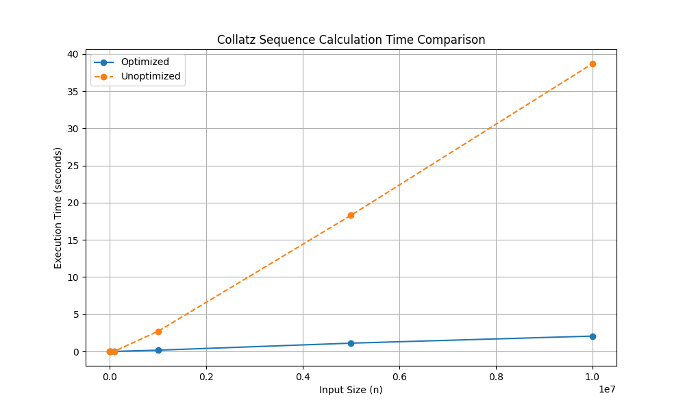

# Collatz Sequence
This code calculates the collatz sequence for large numbers.

## Optimization
It optimizes by saving numbers it already calculated and how long their sequence is. E.g:
```
Calculating:
> 2: ?
>        2
>        1
> 2: 2

# And then later:
Calculating:
> 3: ?
>        3
>        10
>        5
>        16
>        8
>        4
>        2: 1 more from here
> 3: 8
```
Here it used the fact that it knew the result of two already and just appended that.
It becomes much more optimized for longer calculations:
```
➜ node collatz.js 1000
    Execution time: 0.423ms

➜ node collatz.js 10000
    Execution time: 1.806ms

➜ node collatz.js 100000
    Execution time: 4.695ms

➜ node collatz.js 1000000
    Execution time: 165.343ms

➜ node collatz.js 5000000
    Execution time: 1.110s

➜ node collatz.js 10000000
    Execution time: 2.061s

➜ node collatz.js 90000000
    Execution time: 24.355s
```

If we remove the storage-optimization, the code runtime looks as follows:
```
➜ node collatz.js 1000
    Execution time: 1.169ms

➜ node collatz.js 10000
    Execution time: 3.758ms

➜ node collatz.js 100000
    Execution time: 35.035ms

➜ node collatz.js 1000000
    Execution time: 2.703s

➜ node collatz.js 5000000
    Execution time: 18.306s

➜ node collatz.js 10000000
    Execution time: 38.697s
```

## Comparison
In the file `./comparison.py` you can find the needed python code to generade the graphic below.
This is how the runtimes compare:  


